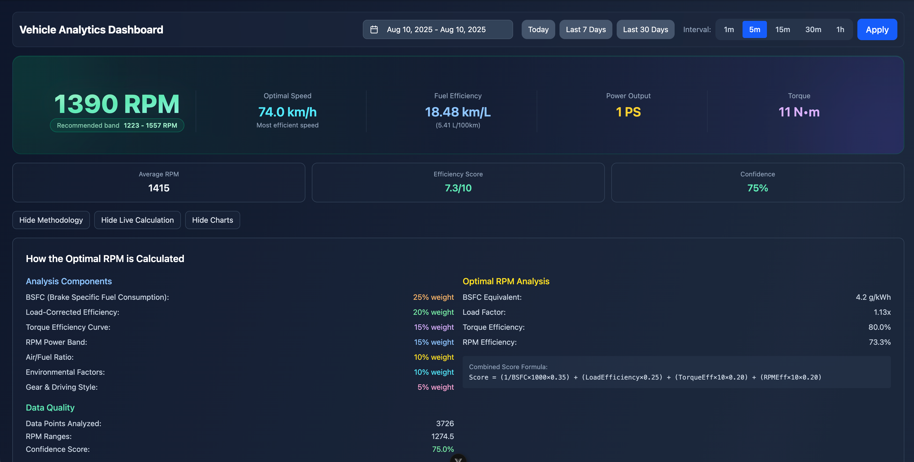

# Carlens 🚗

[](LICENSE)
[](https://www.typescriptlang.org/)
[](https://vuejs.org/)
[](https://www.mongodb.com/)



A modern vehicle analytics dashboard application that processes real-time telemetry data from OBD-II systems. Built as a full-stack TypeScript monorepo with Vue 3 frontend, Fastify backend, and MongoDB time-series storage.

## ✨ Features

- **Real-time Telemetry**: Live vehicle data visualization from OBD-II systems
- **Time-series Analytics**: Historical data analysis and trend visualization  
- **Interactive Dashboard**: Responsive charts and metrics with Vue ECharts
- **MongoDB Integration**: Optimized time-series data storage and querying
- **Type-safe APIs**: Shared TypeScript types across frontend and backend
- **Monorepo Architecture**: Organized workspace with Bun package manager

## Workspace Structure

```
carlens/
├── packages/
│   ├── carlen/          # Vue 3 frontend application
│   ├── server/          # Fastify backend API
│   ├── shared-types/    # Shared TypeScript types
│   └── sync/            # MongoDB sync utility
└── package.json         # Root workspace configuration
```

## Package Overview

### @carlens/carlen (Frontend)
- Vue 3 with Composition API
- Vite build tool
- Shadcn-Vue components
- Vue ECharts for visualization
- CSS Modules for styling

### @carlens/server (Backend)
- Fastify web server
- MongoDB integration
- Time-series API endpoints
- Vehicle telemetry data management

### @carlens/shared-types (Types)
- Shared TypeScript interfaces
- API request/response types
- OBD data structures
- Vehicle and engine metrics

### @carlens/sync (Data Sync)
- MongoDB synchronization utility
- CSV parsing and processing
- OBD-II data ingestion

## Development Scripts

```bash
# Install dependencies for all packages
bun install

# Run the backend server
bun run server

# Build the frontend
bun run build:client

# Run linting across all packages
bun run lint

# Type checking across all packages
bun run type-check
```

## Package Scripts

### Frontend Development
```bash
# From packages/carlen/
bun run dev     # Start development server
bun run build   # Build for production
bun run lint    # Run linting
```

### Backend Development  
```bash
# From packages/server/
bun run start   # Start production server
bun run dev     # Start with file watching
```

### Data Synchronization
```bash
# From packages/sync/
bun run sync    # Sync CSV data to MongoDB
```

## Shared Types Usage

All packages can import shared types:

```typescript
import type { 
  ApiResponse, 
  TimeseriesDataPoint, 
  ObdReading 
} from '@carlens/shared-types';
```

## 🚀 Quick Start

### Prerequisites

- [Bun](https://bun.sh/) >= 1.0.0
- [MongoDB](https://www.mongodb.com/) >= 6.0
- Node.js >= 18.0.0 (for compatibility)

### Installation

1. **Clone the repository**
   ```bash
   git clone git@github.com:nguyenvanduocit/carlens.git
   cd carlens
   ```

2. **Install dependencies**
   ```bash
   bun install
   ```

3. **Set up environment variables**
   ```bash
   cp packages/server/.env.example packages/server/.env
   # Edit packages/server/.env with your MongoDB connection details
   ```

4. **Start the development servers**
   ```bash
   # Start backend server
   bun run server
   
   # In another terminal, start frontend (if available)
   bun run dev:client
   ```

## 📊 Data Sources

Carlens works with CSV telemetry data from OBD Fusion and other OBD-II logging applications. The system processes:

- **Engine Metrics**: RPM, coolant temperature, load values, fuel consumption
- **Vehicle Dynamics**: Speed, acceleration, throttle position, gear selection  
- **Environmental Data**: Barometric pressure, intake air temperature
- **GPS Tracking**: Latitude/longitude coordinates for route mapping
- **Performance Data**: Engine power (PS), torque (N•m), transmission metrics

## 🛠️ Architecture

### Technology Stack
- **Frontend**: Vue 3 + Composition API + Vite + Shadcn-Vue + Vue ECharts
- **Backend**: Fastify + MongoDB Driver + TypeScript
- **Database**: MongoDB with time-series collections
- **Package Manager**: Bun (workspace monorepo)
- **Styling**: CSS Modules + Tailwind CSS

### API Design
The client communicates exclusively with the backend via HTTP APIs:
- Pure UI frontend with no direct file system access
- RESTful API endpoints for vehicle data and analytics  
- Real-time data updates and auto-refresh capabilities
- Type-safe communication via shared TypeScript interfaces

## 📋 Environment Variables

Create a `.env` file in `packages/server/` with:

```bash
MONGODB_URI=mongodb://localhost:27017
DATABASE_NAME=carlens_telemetry
PORT=3001
HOST=0.0.0.0
```

## 🤝 Contributing

We welcome contributions! Please see [CONTRIBUTING.md](CONTRIBUTING.md) for guidelines.

## 📄 License

This project is licensed under the MIT License - see the [LICENSE](LICENSE) file for details.

## 🔒 Security

For security concerns, please see [SECURITY.md](SECURITY.md) for our security policy and reporting procedures.